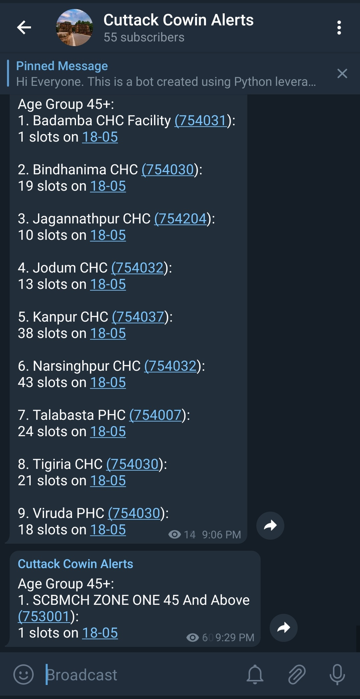

# CowinTracker with Telegram Bot
## _Vaccine slot alert application_

CowinTracker is a bot created using Python leveraging open source Cowin APIs. It alerts users from a particular district to book slots as they arrive or as soon as someone cancels.

The bot checks availability of slots every 10 seconds and drops an alert. The alerts contain both 18+ and 45+ slots in government run UPHCs.




## Tech

CowinTracker uses a number of open source projects to work properly:
- Python - Duh. Do we even say?
- RestAPI - Making cross-connections great again!
- Telegram - Online piracy hub but sometimes immensely powerful.

## Setting Up District
The file **_utils/district_mapping.csv_** has the district ids for all districts in India. You need to select for which district you wish to run the bot, copy the district id and paste it under **DIST_ID** in **_config/config.py_**

## Set Up & Installation

You need to have a Telegram account, a bot and a channel created. 
Learn how to create bot from [here](https://core.telegram.org/bots#3-how-do-i-create-a-bot). Make sure you note the bot token and keep it hidden. Creating a channel in Telegram is super easy, but [here you go](https://olhardigital.com.br/en/2021/01/14/tira-duvidas/aprenda-a-criar-canais-no-telegram-pelo-celular/). Next up, you need to add the bot to the channel and make it an admin. Once that's done, we need to figure out the _chat id_ of the channel. For this first, drop a 'hi' into the channel and then run the below in browser:
```sh
https://api.telegram.org/bot<BotToken>/getUpdates
```

Note the chat id, and paste the chat id inside the ENV file in _config_ directory. Also paste your secret bot token in the ENV file.

Next up, install the dependencies and start the server.

```sh
$ cd cowin_slot_alerts
$ python -m pip install virtualenv 
$ virtualenv venv
$ venv/Scripts/activate
$ python alert_slots_by_district.py
```

## Development
This project was completed in less than 12 hours. So pardon the mistake. Also if you want to contribute? Fork ahead.


## License

MIT


